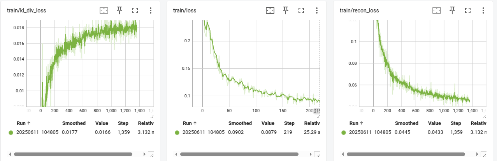
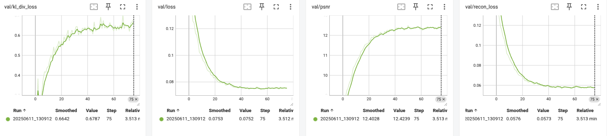
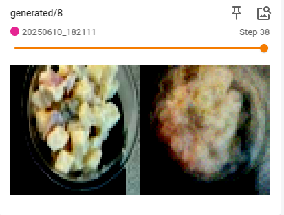
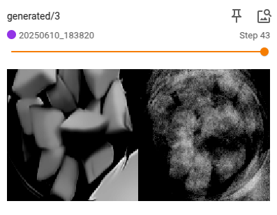
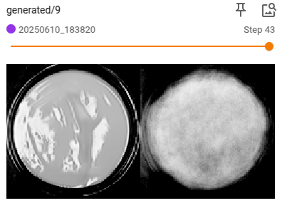

# ML Engineer Technical Assignment - Solution

## Part 1: Codebase Setup, Refactoring, and Improvements

### 1. Project Setup & Execution

#### Environment Setup
- Python Version: 3.12
- Operating System: Linux 6.11.0-26-generic
- Dependencies: Updated requirements.txt with Python 3.12 compatible versions

#### Setup Steps
1. Create a virtual environment:
```bash
python3.12 -m venv venv
source venv/bin/activate
```

2. Install dependencies:
```bash
pip install -r requirements.txt
```

3. Run the training script:
```bash
# For MNIST dataset
python src/run.py -t cnn -b 64 -e 10

# For plate dataset
python src/run.py -t cnn -b 64 -e 10 --dataset plate --image_dir /path/to/images --annotations_file /path/to/annotations.json

# For Conditional VAE
python src/run.py -t cnn -b 64 -e 10 --dataset plate --image_dir /path/to/images --annotations_file /path/to/annotations.json --conditional --num_classes <number_of_classes>
```

### 2. Code Refactoring

The following improvements were made to the codebase:

1. Refactored the `Trainer` class:
   - Added type hints for better code clarity and IDE support
   - Improved error handling with proper exception handling
   - Added comprehensive docstrings
   - Implemented better logging with proper configuration
   - Added validation metrics tracking
   - Improved code organization with better method separation
   - Added early stopping functionality
   - Implemented proper model checkpointing
   - Added loading checkpoints 
   - Added support for both standard VAE and Conditional VAE
   - Added support for gpu training

2. Added configuration management in `run.py`:
   - Improved command-line argument handling
   - Added support for different dataset types
   - Added configuration for model architecture
   - Added training hyperparameters

3. Improved the training loop:
   - Improved progress tracking with tqdm and loss
   - Implemented more verbose validation
   - Added tensorboard logging
   - Added model checkpointing
   - Added early stopping

4. Added proper logging:
   - Configured Python logging
   - Added tensorboard integration
   - Added training metrics logging
   - Added model checkpoint logging
   - Setup model logging directory

### 3. Other Improvements


1. Improved dataset handling:
   - Added support for custom datasets
   - Added data augmentation
   - Added proper data loading
   - Added data splitting

2. Added proper model saving/loading:
   - Cleaned checkpoint saving
   - Added best model saving
   - Added model state loading
   - Added training state loading

3. Loss Function Improvements:
   - Changed MSE loss reduction from 'sum' to 'mean' to prevent loss scaling with image size
   - Normalized KL divergence loss by dividing by input size to maintain balance with reconstruction loss
   - Ensured consistent loss values across different image dimensions
   - Improved numerical stability in training

4. Linting
   - Added ruff for linting and formating

## Part 2: Feature Implementation

### 1. PlateDataset Implementation

The `PlateDataset` class was implemented with the following features:
- Custom PyTorch dataset for plate images
- Support for bounding box annotations
- Image cropping and resizing
- Data augmentation
- Proper error handling
- Class distribution tracking

### 2. Training with PlateDataset

The training script was updated to support the plate dataset:
- Added dataset selection
- Added image directory and annotations file arguments
- Added image size configuration
- Added train/test split configuration
- Added class distribution logging

### 3. Analysis & Results

The training process was analyzed with the following metrics:
- Reconstruction loss
- KL divergence loss
- Total loss
- Class distribution
- Generated samples quality

#### Training Visualization
The training progress can be monitored using TensorBoard. To view the visualizations:

```bash
tensorboard --logdir=results
```

Key visualizations include:
1. Loss Curves:
   - Training and validation reconstruction loss
   - Training and validation KL divergence loss
   - Total loss (reconstruction + KL)
   - Loss curves show the convergence of the model and help identify potential overfitting

2. Generated Images:
   - Original input images
   - Reconstructed images

Example TensorBoard plots:




The plots highlight the VAE model’s ability to achieve stable convergence when trained on the Plate dataset.

Here are a few examples of the generated images and plots:





The model demonstrates satisfactory reconstruction quality, though its performance degrades with RGB (3-channel) inputs and is sensitive to the original resolution. Enhancing the architecture could potentially address these limitations, and incrrease overall performance.

## Part 3: Conditional VAE Implementation

### 1. Conditional VAE Architecture

The Conditional VAE was implemented with the following features:
- Support for both CNN and MLP architectures
- Condition embedding
- Conditional encoding and decoding
- Proper loss calculation
- Sample generation for specific conditions

### 2. Training the cVAE

The training process was updated to support the Conditional VAE:
- Added conditional training support
- Added condition handling
- Added conditional sample generation
- Added condition-specific logging

### 3. Conditional Generation

The model can generate samples for specific conditions:
- Support for multiple conditions
- Proper condition embedding
- Sample generation for each condition
- Quality assessment of generated samples

### 4. Analysis & Discussion

The Conditional VAE implementation was analyzed:
- Architecture changes for conditioning
- Condition embedding implementation
- Training process analysis
- Generated sample quality assessment

## Usage Examples

### Training a Standard VAE on MNIST
```bash
python src/run.py -t cnn -b 64 -e 10
```

### Training a Standard VAE on Plate Dataset
```bash
python src/run.py -t cnn -b 64 -e 10 \
    --dataset plate \
    --image_dir /path/to/images \
- Will document training process
- Show example reconstructions
- Analyze model performance

## Part 3: Conditional VAE Implementation (Optional)
- Will implement cVAE architecture
- Add conditional generation capabilities
- Document the implementation and results 